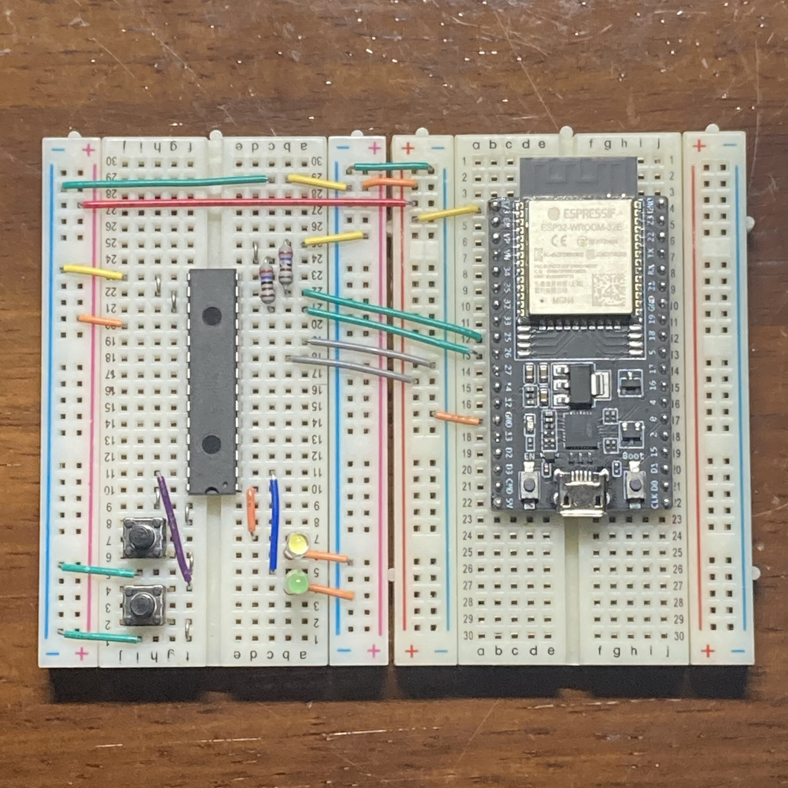

# esp32_mcp23017

## 概要
esp-idf(C++)でI2C I/Oエクスパンダ MCP23017 を制御するクラスとサンプルプログラム
GPIOのInput/Outputピンを増やすことができます。

MCP23017クラス(mcp23017.h)が実際の制御を行うクラスです。
main.ccの中で設定を行い、GPIOの内容を読み取って、別のGPIOに出力をしています。

## 配線例

ピンの変更はmain.ccの定数で行うことができます。

## 環境
ESP-IDF v5.2-37

MCP23017 (株式会社秋月電子通商 販売ページ)
https://akizukidenshi.com/catalog/g/g109486/

## 注意点
- この実装では割り込みピンを利用していません。
- 速度が必要な用途には向いていません。読み書きの頻度が多いため、場合によっては一括読み書きの実装が必要になるかもしれません。

## 参考資料
https://ww1.microchip.com/downloads/jp/DeviceDoc/20001952C_JP.pdf
https://404background.com/circuit/mcp23017/

